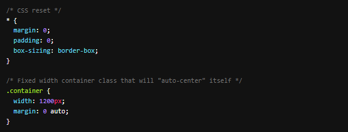

# CSS Library

- Learn about creating a library of reusable code

Start with the following stylesheet called `dojo.css`

- [x] Add your favorite button style from the Button Up assignment and call it .btn

- [x] Add .row and .col classes from the FLEX-Ible Columns assignment

- [x] Add the .navbar class(es) from the Flex Navbar assignment

- [x] Continue adding any cool classes that you have made / will make

Here is an example of mine below. 

